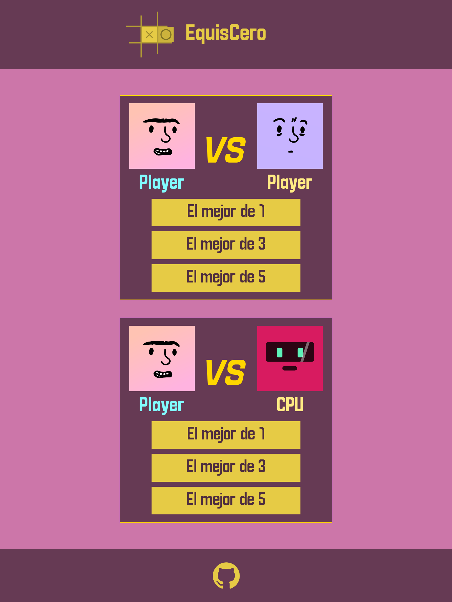

 

 
<h1 align="center">equisCero</h1>

**equisCero** es un juego web del [tic tac toe](https://es.wikipedia.org/wiki/Tres_en_l%C3%ADnea) PVSP/PVSCPU.

Este proyecto forma parte del plan de estudio de [The Odin Project](https://www.theodinproject.com/lessons/node-path-javascript-tic-tac-toe).

## 📷 Screenshots

<strong>Mobile</strong>

  
   
     
 
 

 

<strong>Tablet</strong>

  
   
     
 

 

<strong>Desktop</strong>

  
   
     

  
   

<strong>Animaciones</strong>

  
   
     

  
   
     

  
   

## 🎮 Demo

-   [¡prueba el juego aquí!](https://moramartin99.github.io/equisCero/)
-   [¡Prototipo aquí!](https://design.penpot.app/#/view/52961d58-0a92-80c2-8003-37db999c4436?page-id=7c174ac5-3057-8062-8003-5a4e7de7341d&section=interactions&index=0&share-id=a0a8e792-b2d2-818e-8005-616b9af37d1d)

## ⚡️ Features

- Diseño responsivo
- Modo de juego **PVSP** y **PVSCPU**
- 2 modos de dificultad para la inteligencia artificial de la CPU en el modo **PVSCPU**
- Juegos de 1, 3 y 5 rounds
- Personalice el nombre de su jugador
- 0 dependencias de javaScript
- Consume la API de [DiceBear](https://www.dicebear.com/) para generar avatares únicos para cada jugador
- Menu de pausa
- Hermosas animaciones 

## 🛠️ Tech Stack

- HTML
- CSS
- javaScript
- Penpot
- Git

