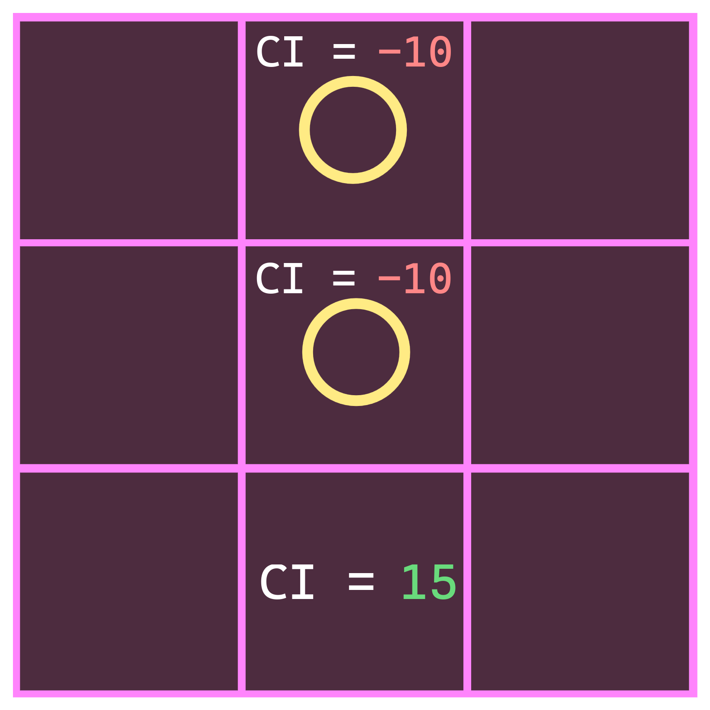
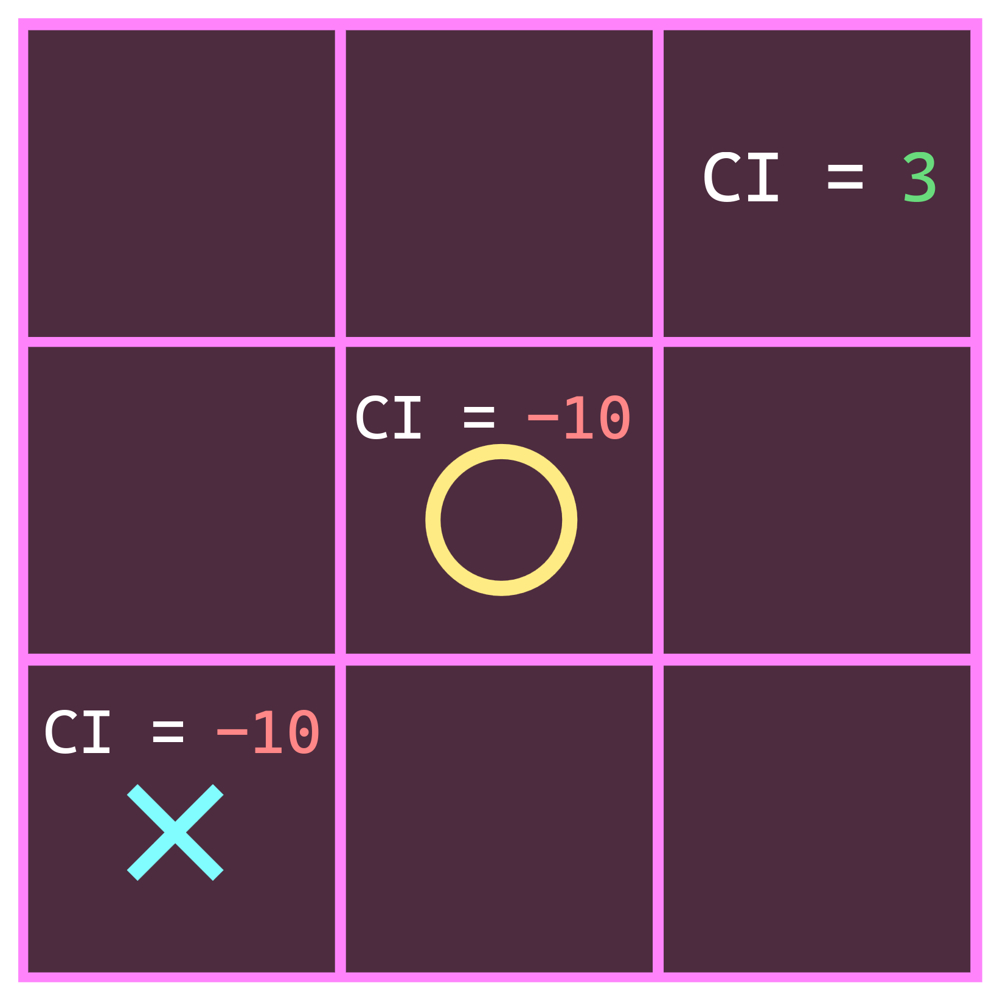
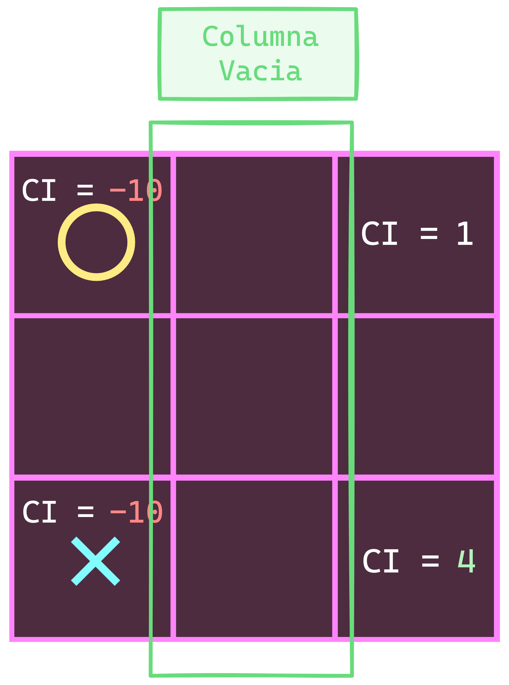

# AI _module_

## Responsabilidad

seleccionar los movimientos de _player_ si el _game.type_ es _PVSCPU_

## Interfaz

-   **init** (_{player: object, difficultyLevel: string, cellGroupGetter: fn aka [getGroups](./board.md#interfaz), triggerEvent: object aka [nextPlayerEvent](./game.md#eventos), dropToken: fn aka [tryToDropToken](./actions.md#implementación)}_) _fn_: responsable de activar el modulo:

    -   _triggerEvent_.subscribe(_playTurn_)

-   **disconnect** _fn_: responsable de invocar _triggerEvent_.unsubscribe(_playTurn_)

## Implementación

-   **playTurn**: Responsable de jugar el turno:

    -   Si `currentPlayer.id !== player.Id` entonces `return`
    -   **chance** _number_: numero del 0 a 1, que representa la probabilidad de invocar _getIdealCell_. 0 es imposible, 1 es inevitable
    -   Si `difficultyLevel === "normal"` entonces `chance = 0.7`
    -   Si `difficultyLevel === "hard"` entonces `chance = 1`
    -   **cell** _object_: [utilities.getRandomItemByProbability](../utilities.md#interfaz)(_[{item: getIdealCell, probability: chance}, {item: getRandomEmptyCell, probability: 1 - chance}]_)()
    -   `dropToken(cell)`

-   **getRandomEmptyCell** _fn_: retorna una _cell_ vacía aleatoriamente

-   **getIdealCell** _fn_: calcula y retorna la _cell_ ideal conforme al [algoritmo](./AI.md#algoritmo)

## Observaciones

-   Las jugadas ganadoras principalmente involucran el uso del centro y las esquinas

## Algoritmo

En cada ronda se genera para cada _cell_ un **choiceIndex** _aka_ **CI** que es un numero que refleja la posibilidad de ser elegida, mientras mas alto mejor, los empates se resuelven aleatoriamente. Los pasos se aplican uno después del otro de manera acumulativo a menos que se indique lo contrario y son los siguientes:

1. Si en board no hay ningún _token_ entonces todas las celdas tienen un `CI = 0`, excepto _corners_ y _center_ que tienen un `CI = 1`

2. Todas las celdas que estén ocupadas tienen un `CI = -10` **permanentemente**

3. Todas las _cell_ que sean la _cell_ restante para que el jugador rival forme un [winnerMove](./board.md#interfaz) tienen un `CI = 15`

<b> <em>Nota: AI juega con las x</em></b>

4. Todas las _cell_ que sean la _cell_ restante para que AI forme un [winnerMove](./board.md#interfaz) tienen un `CI = 20`

<b> <em>Nota: AI juega con las x</em></b>

5. Si el _center_ esta rodeado por al menos 1 _token_ del rival entonces `CI = 3`

<b> <em>Nota: AI juega con las x</em></b>

6. Si el _center_ esta ocupado por el rival y _AI_ controla solo 1 _corner_ en el tablero, el _corner_ opuesto tendrá un `CI = 3`:

<b> <em>Nota: AI juega con las x</em></b>

7. Si en el tablero hay al menos 1 _token_ del rival y si un _corner_ no interseca con ningún _token_ del rival en su fila y columna entonces tendrá `CI = CI + 1`

<b> <em>Nota: AI juega con las x</em></b>

8. Si un _corner_ forma parte de una fila con las siguientes características tendrá un `CI = CI + 3`:

    - Contiene un _edge_ vació
    - El _corner_ restante es un _token_ de _AI_
    - El _edge_ forma parte de una columna que esta vacía

<b> <em>Nota: AI juega con las x</em></b>

9. Si un _corner_ forma parte de una columna con las siguientes características tendrá un `CI = CI + 3`:

    - Contiene un _edge_ vació
    - El _corner_ restante es un _token_ de _AI_
    - El _edge_ forma parte de una fila que esta vacía

<b> <em>Nota: AI juega con las x</em></b>

10. Si un _corner_ permite armar 2 _winnerMove_ en simultaneo para el siguiente turno de _AI_ entonces tendrá un `CI = 10`:

<b> <em>Nota: AI juega con las x</em></b>

